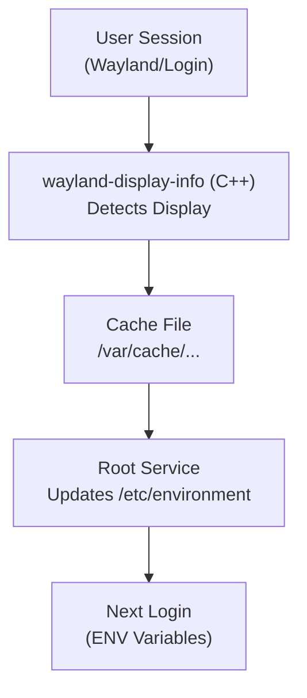

# Wayland Font DPI

Automatic text scaling for Wayland compositors based on physical display DPI, ensuring sharp text without the blurriness of fractional display scaling.

## 🎯 What This Tool Does

Your text looks too small on your high-DPI display? This tool automatically adjusts font and UI scaling to match your display's physical DPI, ensuring:

- **Sharp text** - No blurry fonts from fractional scaling
- **Correct physical sizes** - 12pt fonts appear as actual 12/72 inches tall
- **Automatic configuration** - Works out of the box with any wlroots-based compositor
- **Universal application support** - GTK, Qt, Electron, Java, and more

## 🚀 Quick Start

### Arch Linux (AUR)

```bash
pikaur -S wayland-font-dpi
# Log out and log back in - that's it!
```

### From Source

First, install [wayland-display-info](https://github.com/acrion/wayland-display-info). Then this project:

```bash
git clone https://github.com/acrion/wayland-font-dpi
cd wayland-font-dpi
sudo ./install.sh
# Log out and log back in
```

## 🤔 Why This Exists

### The Problem with Wayland Fractional Scaling

Most compositors implement fractional scaling by asking every client to render at the next higher integer HiDPI factor (usually 2 ×) and then down- or up-scaling that buffer to the requested factor (e.g. 1.25 ×, 1.5 ×).

* Applications whose toolkits already produce a 2 × buffer – such as most GTK 3/4 programs like Abiword – stay pin-sharp, because the compositor only downsamples surplus pixels.
* Applications that still draw at 1 × – many Electron, Java, legacy Qt 5 or XWayland apps (e. g. LibreOffice, VSCode) – are up-scaled and therefore look blurry.
* Modern Qt 6.6+ applications (e.g. Okular 6, Kate 6) can render at the exact fractional factor via the new `wp-fractional-scale-v1` protocol and also remain sharp.

Until every major toolkit supports that protocol, fractional scaling will stay hit-or-miss – which is why *Wayland-Font-DPI* keeps the compositor scale at 1.0 and adjusts text sizes instead.

### A quick visual comparison 🔍

| Compositor scale | 1 × | 1.5 × | 2 × |
|------------------|-----|-------|-----|
| **Wayland fractional scaling** |  |  |  |
| **Font-only scaling (this tool)** |  |  |  |

> **Top row:** Wayland’s built-in fractional scaling (the compositor stretches each 1 × buffer), causing soft edges at 1.5 × and 2 ×.  
> **Bottom row:** *wayland-font-dpi* keeps compositor scale at **1.0** and adjusts only text/UI scale. All columns remain tack-sharp because each application renders crisply in its native resolution.

### The Solution

Instead of scaling the entire display, this tool:
1. Keeps Wayland display scaling at 1.0 (native resolution)
2. Adjusts font and UI element scaling through environment variables
3. Ensures text is rendered at its exact size without bitmap scaling

## 📐 Understanding DPI and Scaling

Most software assumes your display has 96 DPI (dots per inch) - a standard from 1990s CRT monitors. Modern displays typically have 140-300 DPI, making everything appear too small.

For example:
- Your display: 150 DPI
- Software assumes: 96 DPI  
- Result: Everything appears 64% of intended size (96/150 = 0.64)
- Solution: Apply 1.56x scaling (150/96 = 1.56)

## 🔧 How It Works



1. **Display Detection**: `wayland-display-info` daemon monitors your displays using wlr-output-management
2. **Cache Storage**: Display information saved to `/var/cache/wayland-display-info/display-info`
3. **Environment Setup**: Root service updates `/etc/environment` with scaling variables
4. **Application**: PAM loads variables at login; GTK settings apply immediately

## 📦 What Gets Configured

### GTK Settings (Immediate Effect)
- `org.gnome.desktop.interface text-scaling-factor` - Despite its name, this scales both text AND graphical UI elements in GTK applications. Takes effect immediately without logout!

### Environment Variables Set
- `QT_SCALE_FACTOR` - Unified Qt 5/6 scaling
- `_JAVA_OPTIONS` - Java AWT/Swing scaling
- `GDK_SCALE=1` - Prevents GTK integer scaling conflicts
- `GDK_DPI_SCALE=1` - Neutralizes legacy GTK DPI settings

### Variables Explicitly Removed
- `QT_FONT_DPI` - Would cause double scaling
- `QT_ENABLE_HIGHDPI_SCALING` - Conflicts with manual scaling
- `ELECTRON_OZONE_PLATFORM_HINT` - Causes flicker on some compositors
- `MOZ_ENABLE_WAYLAND`/`MOZ_DISABLE_WAYLAND` - Firefox auto-detects since v121

## 🔄 Comparison with way-displays

[way-displays](https://github.com/alex-courtis/way-displays) is great for display management but uses Wayland's native (blurry) scaling.

To use both tools together, configure way-displays to disable scaling:

```yaml
# ~/.config/way-displays/cfg.yaml
SCALING: true
AUTO_SCALE: false
```

Then let wayland-font-dpi handle DPI-correct text scaling while using way-displays for resolution, arrangement, and rotation.

## 📋 Requirements

Runtime requirements:
- Any wlroots-based compositor (Wayfire, Sway, Hyprland, etc.)
- `bc` - Floating-point calculations
- `systemd` - Service management
- `dbus` - Environment updates
- `glib2` - GTK settings (gsettings)
- `inotify-tools` - File monitoring
- `gawk` - Text processing

Build dependencies:
- `wayland` - Wayland client library
- `wlr-protocols` - Protocol definitions
- `gcc` - C++ compiler
- `pkgconf` - Package compiler and linker metadata toolkit

## 🎮 Usage

After installation:
1. **Log out and log in** - Environment variables take effect
2. That's it! Everything runs automatically

Manual checks:
```bash
# Service status
systemctl status wayland-font-dpi.service
systemctl --user status wayland-display-info.service
systemctl --user status wayland-font-dpi-session.service

# View logs
journalctl -t wayland-font-dpi

# Check detected displays
cat /var/cache/wayland-display-info/display-info

# Check applied settings
grep WAYLAND-FONT-DPI -A20 /etc/environment
gsettings get org.gnome.desktop.interface text-scaling-factor
```

## ⚙️ Technical Details

### Architecture

Two components work together:

1. **Root Service** (`wayland-font-dpi.service`)
   - Monitors `/var/cache/wayland-display-info/display-info` (updated by separate service wayland-display-info)
   - Updates `/etc/environment` when display configuration changes
   - Runs continuously with inotify

3. **User Session Service** (`wayland-font-dpi-session.service`)
   - Applies GTK text scaling via gsettings
   - Takes effect immediately without logout

### DPI Calculation

Uses the Pythagorean theorem for diagonal DPI:

```
DPI = sqrt(width_px² + height_px²) / sqrt(width_mm²/25.4² + height_mm²/25.4²)
scale = actual_DPI / 96
```

### Live Session Updates

The root service attempts to propagate variables to running sessions using:
- `systemctl --user set-environment`
- `dbus-update-activation-environment`

This is best-effort - most applications require a fresh login to pick up environment changes. GTK applications are the exception, updating immediately via gsettings.

## 🚧 Limitations

- **First-time setup**: Log out and log in after installation
- **Display hotplug**: New scaling requires logout/login (except GTK apps)
- **Wayland scaling must stay at 1.0**: Don't use compositor scaling
- **Application support varies**: Some apps may need manual configuration

## 🤝 Contributing

Issues and pull requests welcome! Please test with your hardware and report any problems.

## 🌟 Integration

This tool will be included by default in [Ditana](https://ditana.org) when using Wayfire as the compositor.